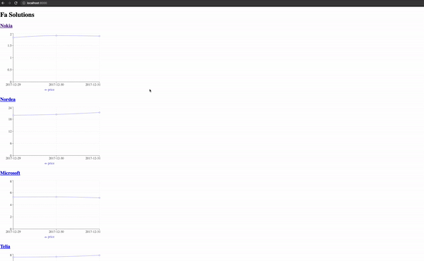

# Documentation

## Overview
The purpose of this project is to build a web application to show stock price of companies.

## Features
1. As a user, he/she could see the overview information of companies' stock
2. As a user, he/she could see the details stock information with 3 days, one week, one month, 6 months, one year with start date

## Requirement
1. Java > 11
2. Maven > 3
3. Node > 16


## Getting started

### Without Docker

1. Start server by running
```
cd fa-solutions-backend
mvn spring-boot:run
```
2. Create env file for client
```
cd fa-solutions-frontend
touch .env

# Copy these config to .env file
VITE_BACKEND_HOST=127.0.0.1
VITE_BACKEND_PORT=8080
```

3. Start web app by running
```
cd fa-solutions-frontend
npm install
npm run dev
```

## How to use the app

